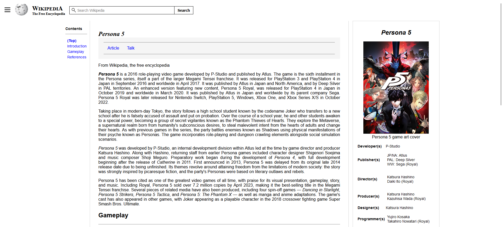

<h1 align="center">Recreating Wikipedia with a Modern Layout 🎮</h1>

This repository contains the project of an HTML challenge, with the goal of recreating a Wikipedia page with a modern layout using HTML5 and its powerful semantic features. The emphasis was on improving the page's accessibility, providing a richer and more inclusive user experience. This project was developed as part of the HTML Web Developer Formation by Digital Innovation One (DIO.me) and aims to apply the knowledge gained in web page structuring.

## ♥️ Challenge

The main goal of the challenge was:

- To use semantic HTML5 to improve the structure and accessibility of the code.
- To structure a simple CSS to complement the design and help in understanding the page.
- To ensure the page is accessible by using screen reader programs such as [NVDA](https://www.nvaccess.org/download/), offering a more inclusive experience.

## ♣️ Solution

To solve the challenge, I recreated the Wikipedia page from *Persona 5*, a turn-based RPG that I am passionate about. In this game, the player controls a student who, together with a group of friends, fights against injustice by entering cognitive worlds called "Palaces".
The layout was modernized, maintaining simplicity and clarity, and following good web development practices with a focus on accessibility.
Below is a portion of the page I created:



## ♦️ How to View

1. Clone this repository to your local machine:
 ```bash
 git clone https://github.com/annielymariah/recreating-wikipedia.git
 ```

2. Open the `index.html` file in your browser to view the developed website.

## ♠️ Credits

All the source code developed during the course was versioned on GitHub. You can access the repository for the challenge proposed by Digital Innovation One through the link below:

- [Digital Innovation One Repository - HTML Track Module 3](https://github.com/digitalinnovationone/trilha-html-modulo-3)

In addition, here is the page I used as a reference for the project:

- [Persona 5 Wikipedia's Page](https://en.wikipedia.org/wiki/Persona_5#Gameplay)